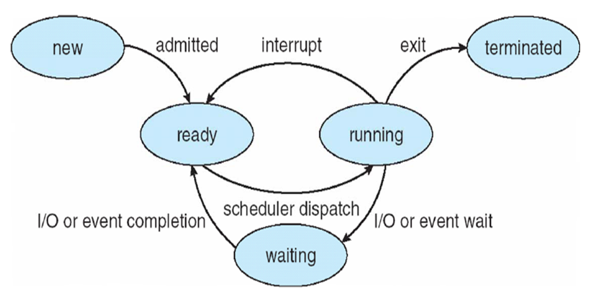

Process
-------
a program in execution, active

registers, program counter text section, data section, stack, heap 포함

  * text section : program code
  * program counter : represent current activity
  * data section : contain global variables
  * stack : contain temporary data
  * heap : memory during process runtime

#### Program

excutable file, passive

When program is loaded into memory, It becomes Process.

> Process 2개 사용시 , 각각 text section, data, heap, stack 가짐

> ex) Process A가 특정 주소 값을 변경해도 Process B는 영향을 받지 않음.

Process state
-------------

* new : process 생성
* ready : process 대기 (할당되기 전)
* running : process 동작
* waiting : process 대기 (I/O나 event에 의해)
* terminated : process 종료

__running은 한순간에 한 process만 가능__
